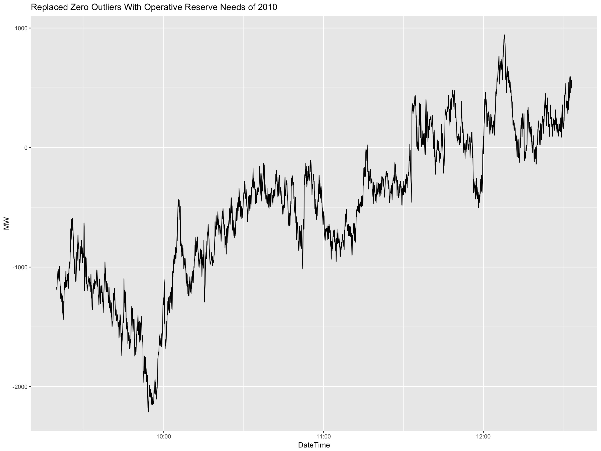
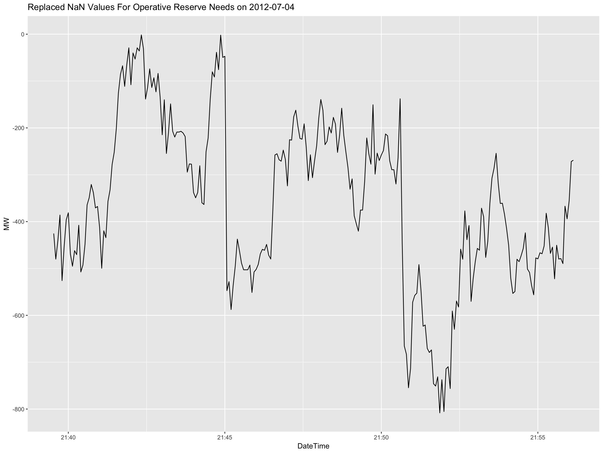
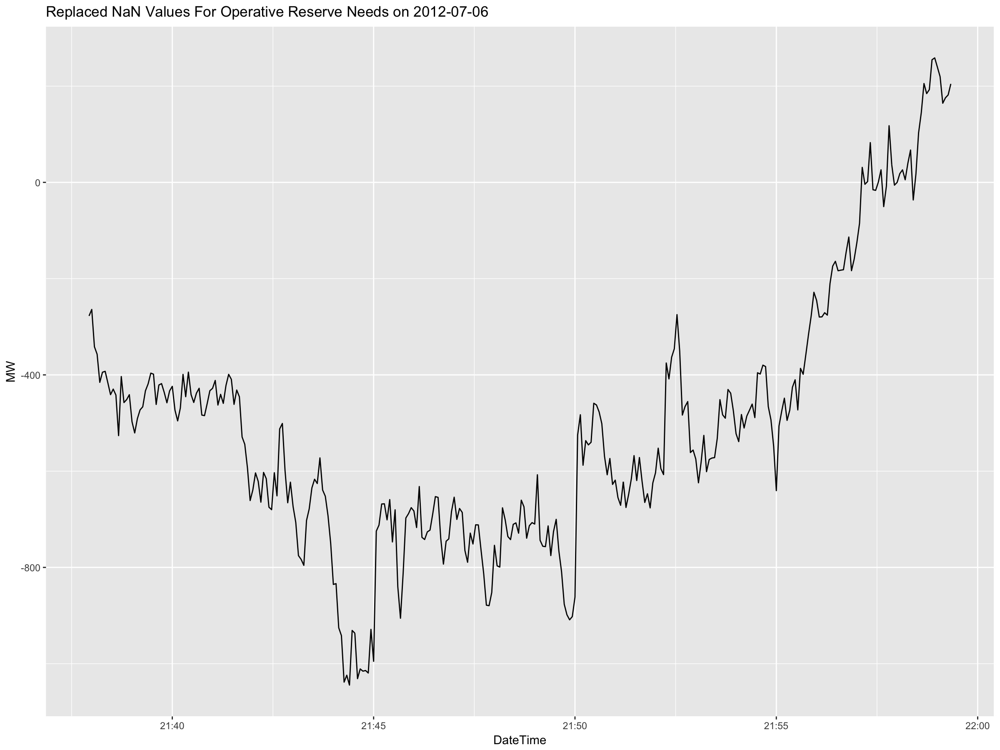
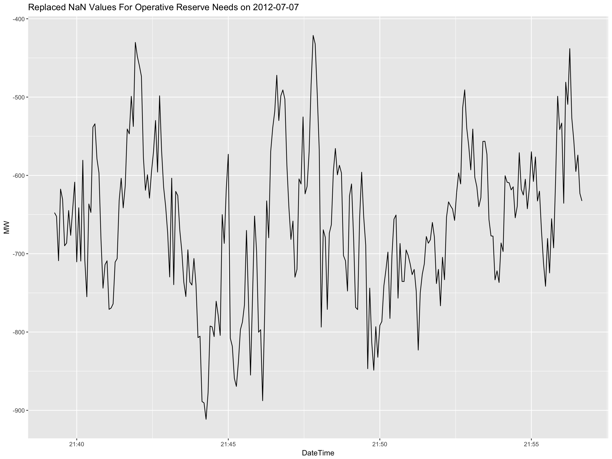
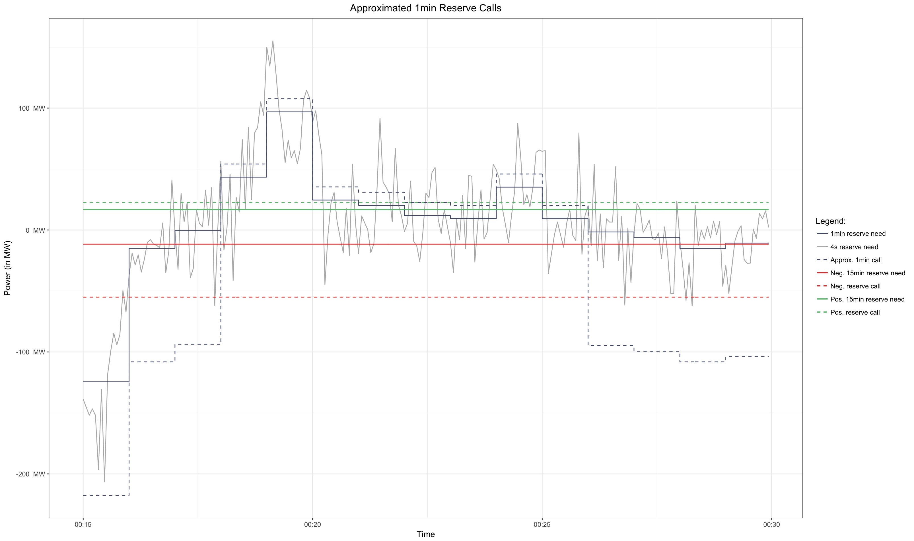
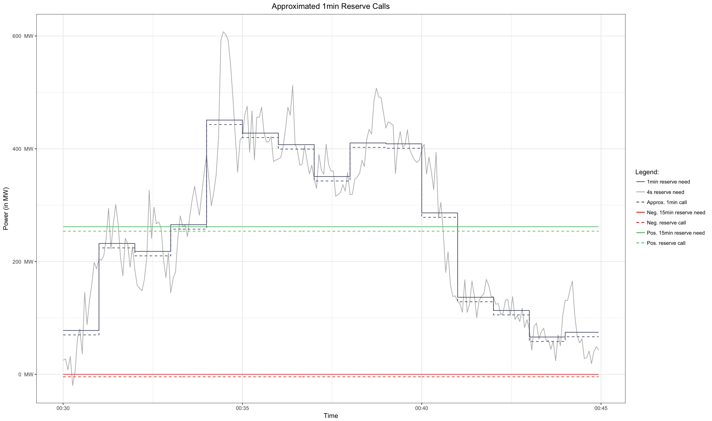
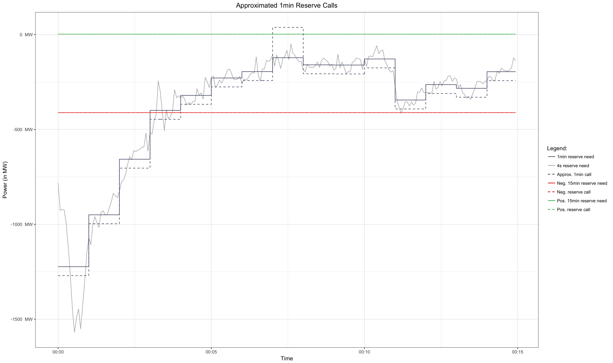
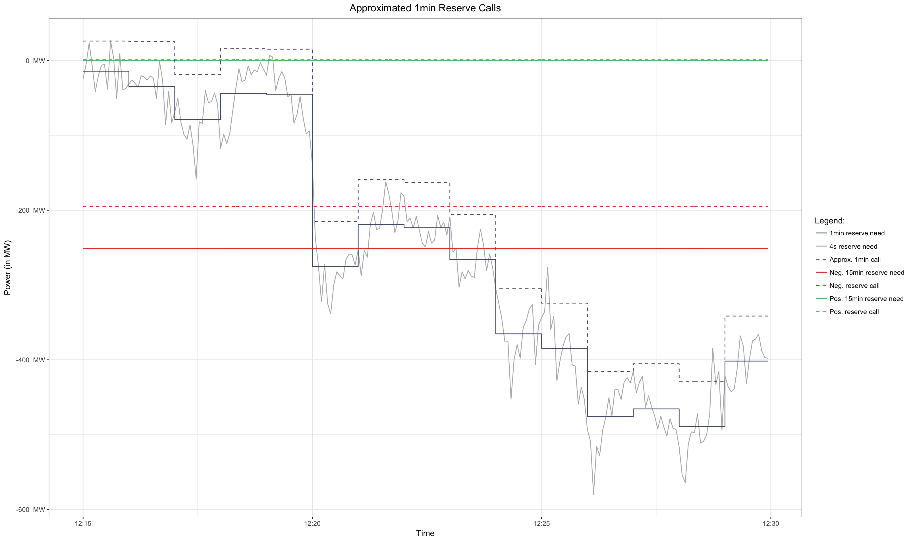
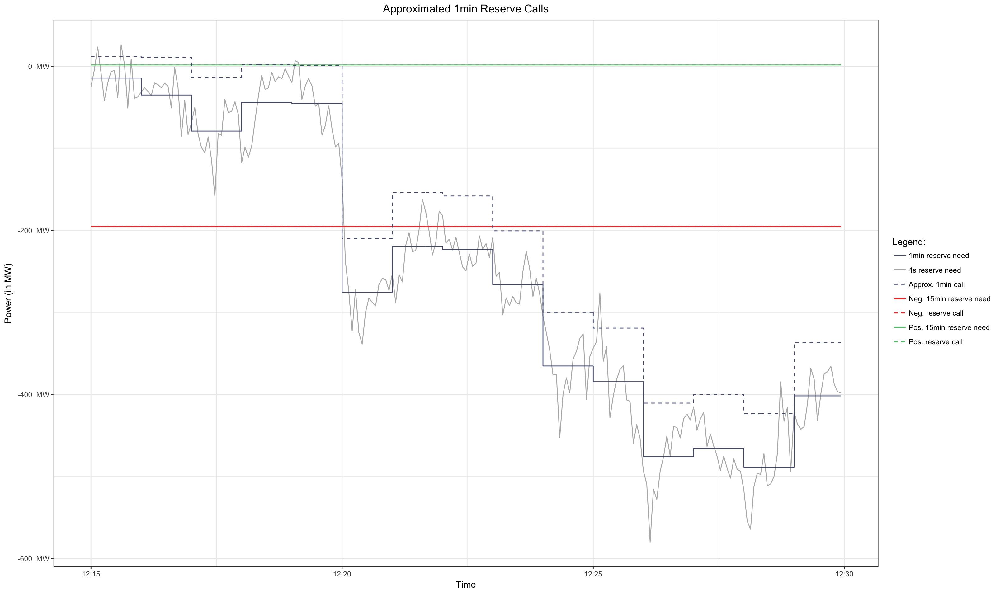

## Data Mining Process

For the following analysis we will apply the CRISP-DM process as seen in the image below. First it is important to precisely define the goal and problem set. Therefore one has to understand the business needs and processes involved. Based on that, the necessary data can be acquired and prepared for the model building step.


{ width=42% }


## Busines Understanding

### Determine Business Objectives

First, to understand the purpose and to be able to interpret the results of the analysis, background information of the business domain is provided in the following section. Hereby, the business objectives for the analysis are defined as well as success criterias to meassure the fulfillment of the goals.

#### Background


##### Secondary Reserve Power

The German Reserve Market distinguishes between three different product types (19/24 european markets follow this pattern [source](http://www.strommarkttreffen.org/2016-1-22-Ocker-German-Secondary-Balancing-Power-Market.pdf.pdf)):

- **Primary Reserve power (PR)**
- **Secondary Reserve Power (SR)**
- **Tertiary Reserve Power (TR)**

Their differences concern the time aspect of power delivery. The image underneath shows the activation duration for full power and the activation time when full power is available. 


{ width=50% }

The focus of this analysis lies on the Secondary Reserve Power since its activation time is reasonable for common energy suppliers. The market for SR is also the biggest. 


##### German Reserve Market

Along with the ... law in 2009 the four german TSOs joined and control the German Reserve Market. Their duty for transparency led to the plattform [regelleistung.net](https://www.regelleistung.net). There all data around the reserve market is published. Also the auction results of the SR. Those auctions are held weeklys from monday till wednesday. The offers account for one week (monday till sunday) and are divided in main period and sub period as well as negative and positive SR. An offer consists of a power price, a work price and the offered SR (negative or positive and its amount in MW). 


##### Scenario: Facility 


#### Objective

The overall aim is to give a more precise estimation for the call probability of working prices of the secondary reserve power. Those probabilities can be used as an input paramter for an optimization algorithm which controlls the energy purchasing and selling flow in both primary energy market and reserve energy market. By now the optimal working prices are set to exceed the contribution margin.


#### Success Criterias


### Assess situation

Satus Quo, Resources, Requirements, Assumptions, Constraints, Terminology


### Determine Data mining Goals

Goals, success criterias


### Data Understanding

Next, we will focus on the understanding of the data. As mentioned previously, the main source is the transparent internet platform [regelleistung.net](https://www.regelleistung.net)

#### Collect Data

A R package exists `rmarketcrawlR` accessable via [github](https://github.com/wagnertimo/rmarketcrawlR) which allows crawiling the platform. It also provides additional functions to approximate minutely secondary reserve calls and hence calculate marginal work prices. 
To get started with the package use `devtools` and its `ìnstall_github()` function.

```{r}
library(devtools)
install_github("wagnertimo/rmarketcrawlR")
```

##### Example Data of 2016

Than you are able to activate the library and aquire the secondary reserve powerd data. We will focus on the year 2016 and get the results of the auctions, the 15 minute reserve calls and the 4 seconds reserve needs. The values rely to the *Netzregelverbund* , a composition of the four german TSOs. After all the data is crawled from the internet, the marginal work prices can be computed by approximating minutely reserve calls.

```{r}
# Activate the package in the workspace
library(rmarketcrawlR)

# Set logging true to be able to comprehend the steps or errors
setLogging(TRUE)

# Get the data of 2016 for operating needs, calls and auctions of secondary reserve power from the Netzregelverbund
needs.2016 = getReserveNeeds('01.01.2016', '31.01.2016')
calls.2016 = getReserveCalls('01.01.2016', '31.01.2016', '6', 'SRL')
auctions.2016 = getReserveAuctions('01.01.2016', '31.01.2016', '2')

# Calculate the marginal work prices for 2016 with 2 cores --> This step takes a while
mwp.2016 = getMarginalWorkPrices(needs.2016, calls.2016, auctions.2016, numCores = 2)
```


> For further information about the  `rmarketcrawlR` package read the `README.md` and the documentation.

##### The complete Data Set of the Analysis

This analaysis will be based on the data of the years from 2011 till 2016 (`2011-07-01 00:00:00 CEST` till `2016-12-31 23:59:00 CET`). These are 5 and a half years of data. The commands below will crawl for the observations. Pre-processing operations to prepare the raw data for analysis is described in the sections below.

```{r}
# Get raw input data
needs.2016 = getReserveNeeds('01.01.2016', '31.12.2016')
calls.2016 = getReserveCalls('01.01.2016', '31.12.2016', '6', 'SRL')
auctions.2016 = getReserveAuctions('01.01.2016', '31.12.2016', '2')

needs.2015 = getReserveNeeds('01.01.2015', '31.12.2015')
calls.2015 = getReserveCalls('01.01.2015', '31.12.2015', '6', 'SRL')
auctions.2015 = getReserveAuctions('01.01.2015', '31.12.2015', '2')

needs.2014 = getReserveNeeds('01.01.2014', '31.12.2014')
calls.2014 = getReserveCalls('01.01.2014', '31.12.2014', '6', 'SRL')
auctions.2014 = getReserveAuctions('01.01.2014', '31.12.2014', '2')


needs.2013 = getReserveNeeds('01.01.2013', '31.12.2013')
calls.2013 = getReserveCalls('01.01.2013', '31.12.2013', '6', 'SRL')
auctions.2013 = getReserveAuctions('01.01.2013', '31.12.2013', '2')


needs.2012 = getReserveNeeds('01.01.2012', '31.12.2012')
calls.2012 = getReserveCalls('01.01.2012', '31.12.2012', '6', 'SRL')
auctions.2012 = getReserveAuctions('01.01.2012', '31.12.2012', '2')


needs.2011 = getReserveNeeds('01.07.2011', '31.12.2011')
calls.2011 = getReserveCalls('01.07.2011', '31.12.2011', '6', 'SRL')
auctions.2011 = getReserveAuctions('01.07.2011', '31.12.2011', '2')

```


#### Describe Data

##### Data Sets and Features


**WHY NETZREGELVERBUND DATA???**

##### Outliers and Missing values

Before we can use the collected raw data for pre-processing it to calculate the marginal work prices and other computations based on that, the data must be cleaned. It is neccessary to handle missing data and outliers. Both has been encountered. Outliers were identified for the operative reserve needs in 2011 and 2012 (data.frames `needs.2011` and `needs.2012`). Those oultliers are characterized by continuous zero values over a longer period of observations. This radical change of reserve power needs is interpreted as an outlier (perhaps a meassuring error).

On the other hand there are some missing values for operative reserve needs in 2012 (data.frame `needs.2012`) and the operative reserve calls in 2011, 2012 and 2013 (data.frames `calls.2011`, `calls.2012` and `calls.2013`). The operative needs values in 2012 show *NaN* values for a few specific dates. Also some reserve calls (negative and positive) of the *Netzregelverbund* are missing in 2011, 2012, and 2013.

All those data.frames have to be pre-processed and cleaned. The procedures are described in the next sections.

> If you want to achieve the same analysis results, it is important to follow these steps since this is the data base of all calculations. It is also important to mention that without treating those outliers and missing (or NaN) values, the `getMarginalWorkPrices()` or `getOneMinuteCalls()` will not work with the compromised data sets.


##### Zero values for operative reserve needs

By investigating the operative reserve needs for 2011 and 2012 there have been outliers detected. There is a constant row of zero values for the reserve needs (in MW) starting at `2011-07-26 11:06:40` till `2011-07-26 12:03:32` (with an exceptional value of *-1221.1385* at `2011-07-26 12:03:00`). This zero row is preceeded and followed by negative reserve needs around the thousand MW area. There are also zeros in 2012 for `2012-08-07 10:19:48` till  (excluding) `2012-08-07 11:33:12`. The abrupt decline and long holding of those zero rows indicates outliers (both sources https://www.transnetbw.de/de/strommarkt/systemdienstleistungen/regelenergie-bedarf-und-abruf#srlbedarf2011 and http://www.50hertz.com/de/Maerkte/Regelenergie/Regelenergie-Downloadbereich show outliers).


```{r}

# function to get the zero outliers
checkForZeroOutliers <- function(df) {
  # Cut the 4sec data in 15 minute blocks to count 0 values for all blocks
  df$cuttedTime <- cut(df$DateTime, breaks = paste("15", "min", sep = " "))
  df$cuttedTime <- as.POSIXct(df$cuttedTime, tz = "Europe/Berlin")
  # Create a variable to mark a zero MW value
  df$count <- ifelse(needs.2011$MW == 0, 1,0)
  
  # Count the zero markers by summing for every 15min block
  r <- df %>%
    group_by(cuttedTime) %>%
    summarise(n= sum(count)) %>%
    filter(n == 225)
  
  return(r)
}


zeroCounts <- checkForZeroOutliers(needs.2011)
head(zeroCounts)

# Output:
#            cuttedTime     n
# 1 2011-07-26 11:15:00   225
# 2 2011-07-26 11:30:00   225
# 3 2011-07-26 11:45:00   225

zeroCounts <- checkForZeroOutliers(needs.2012)
head(zeroCounts)
#            cuttedTime     n
# 1 2012-08-07 10:30:00   225
# 2 2012-08-07 10:45:00   225
# 3 2012-08-07 11:00:00   225
# 4 2012-08-07 11:15:00   225
```

To replace or impute those zero values we could simply take the data of the (two) year before on `2010-07-26` (`2010-08-07`). I will show the replacement procedure for the data of 2011. Therefore we will compare  some statistics with the observations of an hour before and after the outliers. 

```{r}

# Get oprative reserve needs of the year before
n.2010 = getReserveNeeds('26.07.2010', '26.07.2010')

n.2011.hour.before <- needs.2011[needs.2011$DateTime >= as.POSIXct("2011-07-26 10:00:00") & needs.2011$DateTime < as.POSIXct("2011-07-26 11:00:00"),]
n.2011.hour.after <- needs.2011[needs.2011$DateTime >= as.POSIXct("2011-07-26 12:00:00") & needs.2011$DateTime < as.POSIXct("2011-07-26 13:00:00"),]
n.2010.hour.at <- n.2010[n.2010$DateTime >= as.POSIXct("2010-07-26 11:06:40") & n.2010$DateTime < as.POSIXct("2010-07-26 12:03:32"),]

summary(n.2011.hour.before$MW)
#    Min. 1st Qu.  Median    Mean 3rd Qu.    Max. 
# -1578.1  -961.5  -753.8  -795.6  -600.0  -270.6 
   
summary(n.2011.hour.after$MW)
#    Min. 1st Qu.  Median    Mean 3rd Qu.    Max. 
# -1597.5 -1154.6  -910.7  -881.0  -697.7     0.0 

summary(n.2010.hour.at$MW)
#     Min.  1st Qu.   Median     Mean  3rd Qu.     Max. 
# -1859.19  -284.38   -72.02  -139.44    60.17   379.32  

```

The statistics show that the distribution is quite different. The mean and median is lower. There are also positive reserve needs in 2010. To gain a better insight of the distribution, we will plot the data with the outliers and then with the replaced 2010 data. The figure in the code snippet below shows the outliers.

```{r}
# hour before and after the hour with the zero values
n.2011.hour <- needs.2011[needs.2011$DateTime >= as.POSIXct("2011-07-26 10:00:00") & needs.2011$DateTime < as.POSIXct("2011-07-26 13:00:00"),]

# Plot the outliers in context of the hour before and after
library(ggplot2)
ggplot(data = n.2011.hour, aes(x=DateTime, y = MW)) +
  geom_line() +
  labs(title="Zero Outliers For Opreative Reserve Needs on 2011-07-26")
```

Now it is time to fit in the 2010 data.

```{r}
# Replace the zero values with the data of the same time period in 2010
n.2011.hour[n.2011.hour$DateTime >= as.POSIXct("2011-07-26 11:06:40") & n.2011.hour$DateTime < as.POSIXct("2011-07-26 12:03:32"),]$MW <- n.2010[n.2010$DateTime >= as.POSIXct("2010-07-26 11:06:40") & n.2010$DateTime < as.POSIXct("2010-07-26 12:03:32"),]$MW

# Plot the replaced data
ggplot(data = n.2011.hour, aes(x=DateTime, y = MW)) +
  geom_line() +
  labs(title="Replaced Zero Outliers With Opreative Reserve Needs of 2010")
```

At the begining there is a spike from around *-1000* to *-300* and then the 2010 data falls back to around *-1800*. This indicates some turbulances. One could argue and try to make this transition more smoothly. So we will modify the data a bit to smooth the extreme values and to get closer to the statistics (see in the section above) of the hours before and after. 

```{r}
# Replace the zero values with the data of the same time period in 2010
n10 <- n.2010[n.2010$DateTime >= as.POSIXct("2010-07-26 11:06:40") & n.2010$DateTime < as.POSIXct("2010-07-26 12:03:32"),]
n10$MW <- ifelse(n10$MW >= -1200, n10$MW - 400, n10$MW + 400)
summary(n10$MW)


n.2011.hour[n.2011.hour$DateTime >= as.POSIXct("2011-07-26 11:06:40") & n.2011.hour$DateTime < as.POSIXct("2011-07-26 12:03:32"),]$MW <- n10$MW

# Plot the modified replacing data
ggplot(data = n.2011.hour, aes(x=DateTime, y = MW)) +
  geom_line() +
  labs(title="Replaced Zero Outliers With Modified Operative Reserve Needs of 2010")
```

This looks quite smooth. It captures the uptrend and downtrend at around `11:30:00` and also the unique spike at the begining. The whole series lies below zero. Now we will replace those values with the original data set of the operative reserve needs in 2011 (`needs.2011`).


```{r}

# Replace the 0 data (outliers) in the 2011 data set with the values of 2010
needs.2011[needs.2011$DateTime >= as.POSIXct("2011-07-26 11:06:40") & needs.2011$DateTime < as.POSIXct("2011-07-26 12:03:32"),]$MW <- n10$MW

# Sanity check that outliers are removed
head(checkForZeroOutliers(needs.2011))
# 0 rows
```

The same was done with the data of 2012. The graphic below shows the fitted *hole*. The data of 2010 was modified by reversing its order (such that it followed the uptrend) and adding 400 MW.

{ width=100% }


##### NaN values for operative reserve needs in 2012

Both sources https://www.transnetbw.de/de/strommarkt/systemdienstleistungen/regelenergie-bedarf-und-abruf#srlbedarf2011 and http://www.50hertz.com/de/Maerkte/Regelenergie/Regelenergie-Downloadbereich show NaN values on the dates `2012-07-04` `2012-07-05` `2012-07-06` and `2012-07-07`.

```{r}
nans <- filter(needs.2012, MW == "NaN")
unans <- unique(format(nans$DateTime, "%Y-%m-%d"))
unans
# "2012-07-04" "2012-07-05" "2012-07-06" "2012-07-07"

# Side Note:
# Time periods for the NaN values
#
# "2012-07-04 21:45:04 CEST" - "2012-07-04 21:50:36 CEST"
# "2012-07-05 21:45:08 CEST" - "2012-07-05 22:01:12 CEST"
# "2012-07-06 21:45:04 CEST" - "2012-07-06 21:52:12 CEST"
# "2012-07-07 21:45:04 CEST" - "2012-07-07 21:50:52 CEST"

```


Next we will look at the data with the NaN values for one (`2012-07-05`) of the four dates. This shows the approach how the rest will be replaced with the data of the year 2010. The data of 2011 is not taken, since this could bias the analysis as it is part of the whole data set. Optional, some values will be adjusted to fit more smoothly into the time series. Therefore we will visualize the time series data with a few values before and after the NaN values depending on the range of the NaN values.
```{r}
# Get the needed data of 2010
n.2010 <- getReserveNeeds("04.07.2010","07.07.2010")
# set the date, e.g. 2012-07-05
date <- 2 
# get the time period of the NaN values
mini <- min(nans[format(nans$DateTime, "%Y-%m-%d") == as.Date(unans[date]), "DateTime"])
maxi <- max(nans[format(nans$DateTime, "%Y-%m-%d") == as.Date(unans[date]), "DateTime"])

mi <- mini - (maxi - mini) # get the date for a few minutes before
ma <- maxi + (maxi - mini) # get the date for a few minutes after


# get the data a few minutes (range of max and min) before and after the NaN values
n <- needs.2012[needs.2012$DateTime >= mi & needs.2012$DateTime <= ma,]

```


Now let us plot the time series data with the NaN *hole* which has to be filled with the data of 2010.
```{r}
# plot the data with the NaN hole
ggplot(data = n, aes(x=DateTime, y = MW)) +
  geom_line() +
  labs(title = paste("NaN Values For Operative Reserve Needs on ", unans[date], sep=""))

```

The next step is to get the data of 2010 and replace the NaN values.
```{r}
# get the dates of the last year
miny <- seq(mini, length=2, by="-2 years")[2]
maxy <- seq(maxi, length=2, by="-2 years")[2]
# get the data of the last year
nr <- n.2010[n.2010$DateTime >= miny & n.2010$DateTime <= maxy,]

# replace the NaN values with that of the last year
n[n$DateTime >= mini & n$DateTime <= maxi,]$MW <- nr$MW
```


Again, the plot with the replaced data gives us an insight on how well the data fits into the time series.
```{r}
# plot the data with the filled hole
ggplot(data = n, aes(x=DateTime, y = MW)) +
  geom_line() +
  labs(title = paste("Replaced NaN Values For Operative Reserve Needs on ", unans[date], sep=""))
```

Here, the data in 2010 seems to be a bit low and the transitions at the end is a bit too steep. Hence, we will adjust those values by adding a constant value of 200 MW.
```{r}
# Optional!!
# Modify and adjust the replacing values
nr$MW <- nr$MW + 200

# replace the adjusted values with that of the last year
n[n$DateTime >= mini & n$DateTime <= maxi,]$MW <- nr$MW
```


This time the data fits more smoothly. There is still a steep ascent of reserve needs at the begining and end, but this is acceptable.
```{r}
# plot the data with the filled hole
ggplot(data = n, aes(x=DateTime, y = MW)) +
  geom_line() +
  labs(title = paste("Adjusted Replace Values For Operative Reserve Needs on ", unans[date], sep=""))
```

If the modification is enough, the data (`nr` data.frame holds the replacing values) can be replaced for the *original* operative needs data set of 2012.
```{r}
# replace NaN VALUES OF the original data set needs.2012
needs.2012[needs.2012$DateTime >= mini & needs.2012$DateTime <= maxi,]$MW <- nr$MW
```

The following graphs show the respective replacement for the other three dates. There were also some adjustment made:

- For `2012-07-04`: `nr$MW = nr$MW - 900`
- For `2012-07-06`: `nr$MW = ifelse(nr$MW < -1250, nr$MW + 800, nr$MW + 300)`
- For `2012-07-07`: `nr$MW = nr$MW + 1200`

{ width=100% }

{ width=100% }

{ width=100% }


##### Missing Values for operative reserve calls

Missing values occur for 15 minute calls of negative and positive SR of the *Netzregelverbund* in 2013, 2012 and 2011:

- **2013:** There are 37 observations in 2013 with missing values. This is around 0.11%. The main date is `2013-12-04`. At `15:45` till the end of the day values for negative and positive SR calls are missing. Then there are four other days (`2013-04-03`, `2013-06-04`, `2013-09-18` and `2013-12-07`) with one observation each.

- **2012:** There are 38 observations in 2012 with missing values. This is around 0.11%. The main dates are `2012-02-26` and `2012-10-27`. with missing values for negative and positive SR calls in the evening and morning hours. Then there are two other days (`2012-08-05`, `2012-09-09`) with one observation each.

- **2011:** There are 235 observations in 2011 (only half the year, starting from `2011-07-01`) with missing values. This is around 1.33%. The dates are too much to list them.


```{r}
# FOR 2013
nrow(calls.2013[is.na(calls.2013$neg_MW), ])
# [1] 37 --> ca. 0.11%
calls.2013[is.na(calls.2013$neg_MW), "DateTime"]
# [1] "2013-04-03 19:00:00 CEST" "2013-06-04 15:00:00 CEST"
# [3] "2013-09-18 08:30:00 CEST" "2013-12-04 15:45:00 CET" 
# [5] "2013-12-04 16:00:00 CET"  "2013-12-04 16:15:00 CET" 
# [7] "2013-12-04 16:30:00 CET"  "2013-12-04 16:45:00 CET" 
# [9] "2013-12-04 17:00:00 CET"  "2013-12-04 17:15:00 CET" 
# [11] "2013-12-04 17:30:00 CET"  "2013-12-04 17:45:00 CET" 
# [13] "2013-12-04 18:00:00 CET"  "2013-12-04 18:15:00 CET" 
# [15] "2013-12-04 18:30:00 CET"  "2013-12-04 18:45:00 CET" 
# [17] "2013-12-04 19:00:00 CET"  "2013-12-04 19:15:00 CET" 
# [19] "2013-12-04 19:30:00 CET"  "2013-12-04 19:45:00 CET" 
# [21] "2013-12-04 20:00:00 CET"  "2013-12-04 20:15:00 CET" 
# [23] "2013-12-04 20:30:00 CET"  "2013-12-04 20:45:00 CET" 
# [25] "2013-12-04 21:00:00 CET"  "2013-12-04 21:15:00 CET" 
# [27] "2013-12-04 21:30:00 CET"  "2013-12-04 21:45:00 CET" 
# [29] "2013-12-04 22:00:00 CET"  "2013-12-04 22:15:00 CET" 
# [31] "2013-12-04 22:30:00 CET"  "2013-12-04 22:45:00 CET" 
# [33] "2013-12-04 23:00:00 CET"  "2013-12-04 23:15:00 CET" 
# [35] "2013-12-04 23:30:00 CET"  "2013-12-04 23:45:00 CET" 
# [37] "2013-12-07 20:00:00 CET"

# FOR 2012
nrow(calls.2012[is.na(calls.2012$neg_MW), ])
# [1] 38 --> ca. 0.11%
calls.2012[is.na(calls.2012$neg_MW), "DateTime"]
# [1] "2012-02-26 20:30:00 CET"  "2012-02-26 20:45:00 CET" 
# [3] "2012-02-26 21:00:00 CET"  "2012-02-26 21:15:00 CET" 
# [5] "2012-02-26 21:30:00 CET"  "2012-02-26 21:45:00 CET" 
# [7] "2012-02-26 22:00:00 CET"  "2012-02-26 22:15:00 CET" 
# [9] "2012-02-26 22:30:00 CET"  "2012-02-26 22:45:00 CET" 
# [11] "2012-02-26 23:00:00 CET"  "2012-02-26 23:15:00 CET" 
# [13] "2012-02-26 23:30:00 CET"  "2012-02-26 23:45:00 CET" 
# [15] "2012-08-05 00:00:00 CEST" "2012-09-09 00:00:00 CEST"
# [17] "2012-10-27 00:00:00 CEST" "2012-10-27 00:15:00 CEST"
# [19] "2012-10-27 00:30:00 CEST" "2012-10-27 00:45:00 CEST"
# [21] "2012-10-27 01:00:00 CEST" "2012-10-27 01:15:00 CEST"
# [23] "2012-10-27 01:30:00 CEST" "2012-10-27 01:45:00 CEST"
# [25] "2012-10-27 02:00:00 CEST" "2012-10-27 02:15:00 CEST"
# [27] "2012-10-27 02:30:00 CEST" "2012-10-27 02:45:00 CEST"
# [29] "2012-10-27 03:00:00 CEST" "2012-10-27 03:15:00 CEST"
# [31] "2012-10-27 03:30:00 CEST" "2012-10-27 03:45:00 CEST"
# [33] "2012-10-27 04:00:00 CEST" "2012-10-27 04:15:00 CEST"
# [35] "2012-10-27 04:30:00 CEST" "2012-10-27 04:45:00 CEST"
# [37] "2012-10-27 05:00:00 CEST" "2012-10-27 05:15:00 CEST"

# FOR 2011
nrow(calls.2011[is.na(calls.2011$neg_MW), ])
# [1] 235 --> ca. 1.33%
calls.2011[is.na(calls.2011$neg_MW), "DateTime"]
# (..)

```


**Impute Missing Values**

For time series analysis on such a data set, it is not appropriate to leave them out. The amount of proportion is quite less, but nevertheless it is better to approximate the missing values. There would be three different approaches:

- **Use the data of other years:** Since there is no intersection with the missing dates, it is possible to impute the missing values with the values of the year before. Only problem is that for 2011 (also for february 2012) no data of 2010 (february 2011) is available. Another option would be to take an average of the *future* data of the years after.
- **Use reserve needs:** It is also possible to use the 4sec reserve needs which are also used for the minutely approximation of the calls.
- **Use the data of the TSOs:** On the given date of missing values, some TSO show SR call data. So one approach would be to sum up those observations and use it to impute the missing values for the *Netzregelverbund*. 


We will go for the latter. Taking the reserve needs would cause a big deviation, since the needs and actual calls differ remarkably. Averaging future years would lead to misinterpretations. Using TSO data seems natural because the summation of the four yield into the *Netzregelverbund* variable. It is also noticed that only one (only for 2011 at `2011-10-30 23:00:00` for one hour 3 TSO lack with data) TSO has missing values for the dates of interest which should keep the error and a possible bias small. This leaves the question how to impute the missing value of that TSO. A simple approach would be to take the value of the day before. This is possible because the first observation has no missing value(`2011-07-01`). The code sample below imputes the data for the already downloaded `data.frames` `calls.2013` `calls.2012` and `calls.2011`.

```{r}
# Use the call data of the 4 TSOs to impute the missing values of the calls (Netzregelverbund) in 2013, 2012 and 2011

# Load the TSO data
# 50Hz (4)
calls.2013.4 = getReserveCalls('01.01.2013', '31.12.2013', '4', 'SRL')
calls.2012.4 = getReserveCalls('01.01.2012', '31.12.2012', '4', 'SRL')
calls.2011.4 = getReserveCalls('01.07.2011', '31.12.2011', '4', 'SRL')
# TenneT (2)
calls.2013.2 = getReserveCalls('01.01.2013', '31.12.2013', '2', 'SRL')
calls.2012.2 = getReserveCalls('01.01.2012', '31.12.2012', '2', 'SRL')
calls.2011.2 = getReserveCalls('01.07.2011', '31.12.2011', '2', 'SRL')
# Amprion (3)
calls.2013.3 = getReserveCalls('01.01.2013', '31.12.2013', '3', 'SRL')
calls.2012.3 = getReserveCalls('01.01.2012', '31.12.2012', '3', 'SRL')
calls.2011.3 = getReserveCalls('01.07.2011', '31.12.2011', '3', 'SRL')
# TransnetBW (1)
calls.2013.1 = getReserveCalls('01.01.2013', '31.12.2013', '1', 'SRL')
calls.2012.1 = getReserveCalls('01.01.2012', '31.12.2012', '1', 'SRL')
calls.2011.1 = getReserveCalls('01.07.2011', '31.12.2011', '1', 'SRL')

tso.list.2013 <- list(calls.2013.1,calls.2013.2,calls.2013.3,calls.2013.4)
tso.list.2012 <- list(calls.2012.1,calls.2012.2,calls.2012.3,calls.2012.4)
tso.list.2011 <- list(calls.2011.1,calls.2011.2,calls.2011.3,calls.2011.4)

#
# Impute missing calls with TSO data
#
imputed.calls.2013 <- imputeMissingCallsWithTSO(calls.2013, tso.list.2013)
imputed.calls.2012 <- imputeMissingCallsWithTSO(calls.2012, tso.list.2012)
imputed.calls.2011 <- imputeMissingCallsWithTSO(calls.2011, tso.list.2011)

# Sanity check that no NA are left
imputed.calls.2013[is.na(imputed.calls.2013$neg_MW), ]
imputed.calls.2012[is.na(imputed.calls.2012$neg_MW), ]
imputed.calls.2011[is.na(imputed.calls.2011$neg_MW), ]

```
> Further references in the analysis to `calls.2013` `calls.2012` and `calls.2011` contain the imputed data sets.


##### Approximation of minutely calls

Since we need a higher resolution for the operative reserve calls (one minute instead of 15 minutes), the next step is now to approximate one minute operative reserve calls from the operative reserve needs data. 

The approximation follows several steps:

1. The 4sec operative reserve needs are averaged on an one minute base. Those 15 observations build the base value which is going to be corrected by the difference of its 15min average and the reserve call value. 

2. The 15min reserve need averages are computed for positive and negative needs and compared to the positive and negative reserve calls respectively.

3. The difference value of the positive (negative) average gets evenly distributed among the positive (negative) minutely reserve needs within that 15 minutes. 

4. This corrected average difference (fractioned by the number of positive (negative) reserve needs) is added up to the one minute reserve need value.

After this procedure the 15 miunte averages of the corrected one minute reserve need should equal the retrieved reserve calls (for positive and negative calls respectively). The figure below shows visually the approximation. The light grey solid line represents the 4sec reserve needs on the `2016-01-01 00:15 - 00:30`. The solid blue step line is the 1min average and the solid green (red) line is the 15min average of positive (negative) reserve needs. On the other hand, you can see the dashed green (red) line which represents the 15min reserve calls. Since the time period is only 15 minutes we see a straight line. The approximated 1min call is the dashed blue step line. You can notice the downward correction for the negative reserves, due to the negative deviation of the 15min average and the reserve call (solid vs. dashed red line). Vice versa, the positive needs are corrected upwards. The corrections are all of the same amount for each minute (depending on positive or negative number of minutes) and are slightly higher than the delta between the 15min average of the reserve needs and the calls, because less positive (negative) minutes have to compensate the whole 15 minute value.

{ width=120% }


**Special cases**


So far you have seen a normal case. But the deviations between reserve needs and calls can be divergent such that the 15min average for the needs shows no value where as reserve calls had been activated. This special case is called **homogenity**. There can be two types of homogenity:

- *Negative homogenity* occurs if all 1min averaged needs within the 15min period are negative (i.e. 15min average is zero), but the 15 minute reserve call show demand for positive reserve power. 

- *Positive homogenity* occurs if all  1min averaged needs within the 15min period are positive (i.e. 15min average is zero), but the 15 minute reserve call show demand for negative reserve power. 

Those two cases are illustrated in the following two graphs. The first graph shows negative homogenity. Hereby, all blue solid lines are in the negative power, but the dashed green light is not aligned with the solid green line on the value of 0 MW. This means there was demand for positive reserve power. The second plot deals with the opposite, negative homogenity case.

{ width=120% }


{ width=120% }

To encounter those special cases. We have to add a minute of positive (in the negative homogentiy case) or negative (in the positive homogenity case)  reserve power which compensates the whole 15 minute reserve call power. The chosen minute will be the smallest absolute value of the positive (negative) powers. Hence, the 15 minute averages have to be newly computed. And then the new difference yields in the new correction value. 

The next plot shows the result of the correction of the negative homogenity case example. You can see that the minute of the 1min averaged reserve need with the lowest negative power value is selected as the positive reserve power minute to compensate the whole 15 minutes. Similarly, the 15 minute average for the negative *minutes* is updated and the new delta is added up for the correction of those minutes. Now the dashed and solid lines are aligned.

{ width=120% }


Now it could happen that with the new correction another (or more) approximated 1 minute call(s) switches its sign. This case is called **zero crossing**. All in all this forces to an iterative approximation process. Thereby, the values get corrected as long as the new 15min average equals the reserve call. The graphic below illustrates such a case on the `2016-01-01 12:15`. The approximation, as it would occur in the normal case, yields to change signs for four minutes which showed negative reserve power needs before. At this state the positive 15 minute average (accounting the four minute values) would not match with the reserve call value. Hence, another iteration (correction process) is needed to equalize both values.

{ width=120% }

In the plot below you can see the result after another correction. Now, the 15 minute average of the reserve needs equals the reserve calls. The values of the four positive *minutes* were lowered, where as the negative *minutes* rose since fewer values have to compensate the positive delta between the reserve calls and needs.

{ width=120% }


The `rmarketcrawlR` package includes a function to calculate the approximation. The code snippet below shows an example on how to get the approximations for 2016. If you are interested in the marginal work prices (as we are), you can skip this function, since the method for computing marginal work prices already contains this correction procedure. 

```{r}
# Calculate the approximated 1min calls from the 4sec operating reserve needs data
approx.calls.2016 = getOneMinuteCalls(needs.2016, calls.2016)

```


##### Calculation of marginal work prices and call probabilities

In the chapters before we dived into the data and pre-processed it. It was also shown how the approximation of the one minute calls is calculated. Now it is time to use the pre-processed data to calculate the marginal work prices for every approximated minute. The output of the approximation function `getOneMinuteCalls()` is not needed, since the `getMarginalWorkPrices()` also computes the approximation. 

The calculation is straight forward. For every minute (observation) the approximated reserve power (positive or negaative), the related time (and its tarif indication) is matched up with the auctions data. The match up orders the auctions from lowest to highest work price bid. Its offered power is cumulated. The bid (offer) where its cumulated value equals or exceeds the approximated reserve power defines the marginal work price. Offers equal or below this price had been called to deliver the reserve power.

To proceed with the analysis, we will now use the `getMarginalWorkPrices()` of the R package to calculate the marginal work prices for 2011 till 2016 on a minutely resolution.
```r
# Calculate the marginal work prices from the preprocessed raw input data (see sections above) for the years 2011 - 2016
mwp.2016 = getMarginalWorkPrices(needs.2016, calls.2016, auctions.2016, numCores = 2)
mwp.2015 = getMarginalWorkPrices(needs.2015, calls.2015, auctions.2015, numCores = 2)
mwp.2014 = getMarginalWorkPrices(needs.2014, calls.2014, auctions.2014, numCores = 2)
mwp.2013 = getMarginalWorkPrices(needs.2013, calls.2013, auctions.2013, numCores = 2)
mwp.2012 = getMarginalWorkPrices(needs.2012, calls.2012, auctions.2012, numCores = 2)
mwp.2011 = getMarginalWorkPrices(needs.2011, calls.2011, auctions.2011, numCores = 2)

# Combine all years into one data set
mwp.2011.2016 = rbind(mwp.2011, mwp.20112, mwp.2013, mwp.2014, mwp.2015, mwp.2016)
```

Now, we have combined all the years of data to a single data.frame. Let us have look at the first observations and the structure of the data.

```{r}
head(mwp.2011.2016)
```
```{r}
str(mwp.2011.2016)
```


#### Explore Data

##### Auctions Data

Firstly, we will investigate the auction results for the SR in 2016. Since we are interested in the work prices, we are going to plot the average work price bid for each week seperated by main and sub period as well as negative and positive SR.

```{r}
# filter by direction
# and get the average of the work price offers
auctions.2016 %>%
  group_by_(.dots = c("date_from", "Direction")) %>%
  summarise(avg = mean(work_price)) %>%
  ggplot(aes(x = date_from, y = avg, colour = Direction)) + 
        geom_line()

```


##### Marginal Work Prices

```{r}
ggplot(data = data.pos, aes(x=marginal_work_price)) +
  geom_histogram(aes(y = (..count..)/sum(..count..)), breaks = seq(0, 100, 1),
                 col="green",
                 fill="green",
                 alpha = .5) +
  labs(title="Histogram for Marginal Work Prices with positive Reserve Power in 2016") +
  labs(x="Marginal Work Price", y="Count")

```


